# Application Load Balancer with Auto Scaling Groups (AWS Project)

## ➤ Overview
This project demonstrates how to configure an **Application Load Balancer (ALB)** integrated with **multiple Auto Scaling Groups (ASGs)** in AWS to achieve **high availability**, **load distribution**, and **auto scaling** based on demand.

The setup includes:
- Three Launch Templates: `home`, `laptop`, and `mobile`
- Three Auto Scaling Groups (ASGs) based on those templates
- One Application Load Balancer (ALB) with path-based routing
- Separate Target Groups for each application type

---
## ➤ **Architecture**

## Architecture Diagram
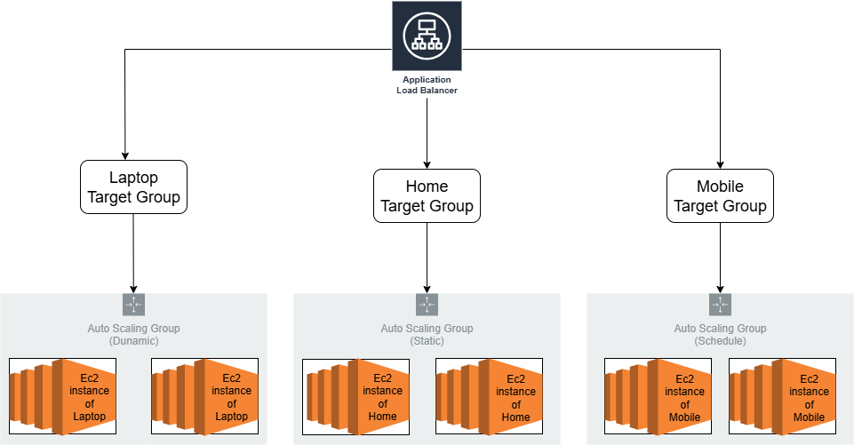

### Architecture Flow:
1. Users access the Application Load Balancer’s DNS name.
2. ALB routes incoming requests based on the path:
   - `/` → Home Target Group  
   - `/laptop/*` → Laptop Target Group  
   - `/mobile/*` → Mobile Target Group
3. Each Target Group is connected to its respective Auto Scaling Group.
4. Auto Scaling adjusts instance counts based on CPU utilization and scheduled events.

---

# ➤ Step-by-Step Implementation

## ➤ **Step 1: Create Launch Templates**
Create **three launch templates**:
1. `home`
2. `laptop`
3. `mobile`

Each template should define:
- AMI (Amazon Linux or your choice)
- Instance type
- Key pair
- Security group
- User data 

   - User data script for Home Launch Template
   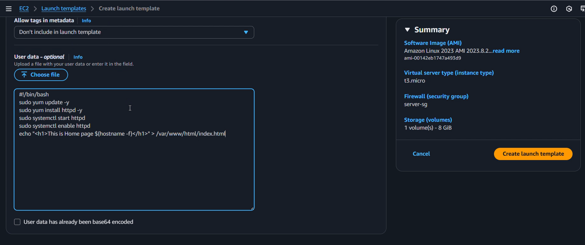

   - User data script for Laptop Launch Template
   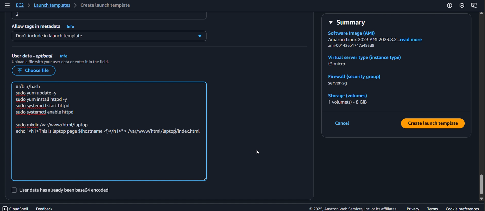

   - User data script for Mobile Launch Template
   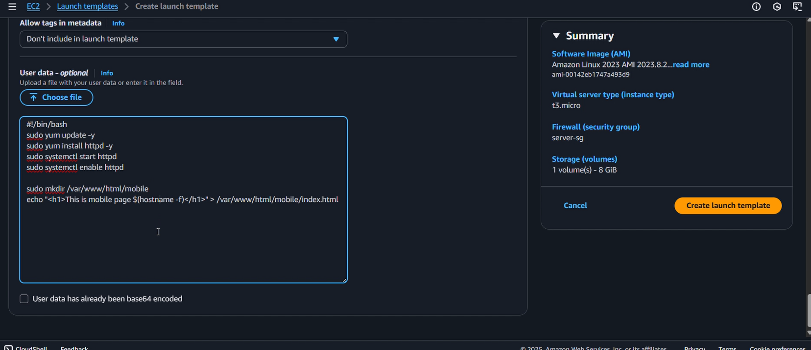

---

## ➤ **Step 2: Create Auto Scaling Groups**

### 1: Home Auto Scaling Group
1. Create ASG using the **home** launch template.  
2. Choose **Easy create** → enable **at least 2 AZs** for high availability.  
3. Select **Balanced best effort** allocation strategy.  
4. Configure:
   - **Desired capacity:** 2  
   - **Minimum capacity:** 2  
   - **Maximum capacity:** 2  
5. No scaling policy.  
6. Click **Next → Next → Create Auto Scaling Group**.

### 2: Laptop Auto Scaling Group
1. Create ASG using the **laptop** launch template.  
2. Choose **Easy create** → enable **at least 2 AZs**.  
3. Allocation strategy: **Balanced best effort**.  
4. Configure:
   - **Desired capacity:** 3  
   - **Minimum capacity:** 2  
   - **Maximum capacity:** 7  
5. Add **Target Tracking Scaling Policy**:
   - Metric type: **Average CPU Utilization**
   - Target value: **50%**
   - Instance warm-up: **300 seconds**  
6. Click **Next → Next → Create Auto Scaling Group**.

### 3: Mobile Auto Scaling Group
1. Create ASG using the **mobile** launch template.  
2. Choose **Easy create** → enable **at least 2 AZs**.  
3. Allocation strategy: **Balanced best effort**.  
4. Configure:
   - **Desired capacity:** 3  
   - **Minimum capacity:** 2  
   - **Maximum capacity:** 7  
5. Add **Target Tracking Scaling Policy**:
   - Metric type: **Average CPU Utilization**
   - Target value: **50%**
   - Instance warm-up: **300 seconds**  
6. Click **Next → Next → Create Auto Scaling Group**.

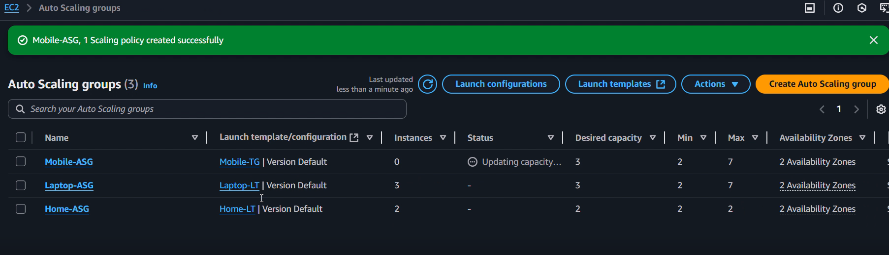

---

## ➤ **Step 3: Schedule Scaling for the home Auto Scaling Group:**

1. Go to **Automatic Scaling → Scheduled Actions → Create**.
   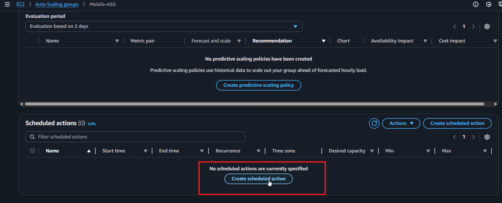

2. Enter:
   - **Name:** `Great_Indian_Sale`
   - **Desired capacity:** 8  
   - **Minimum capacity:** 5  
   - **Maximum capacity:** 15  
   - **Cron expression:** `0 10 21 10 *`
   - **End time:** `2025/10/30 10:30` 
 
3. Click **Create**.
   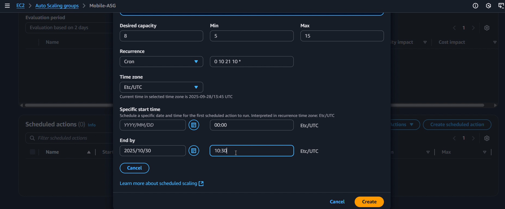

---

### ➤ **Step 4: Create Target Groups**
1. **Home Target Group**
   - Target type: Instance
   - Protocol: HTTP Port:80
   - Name: `Home-TG`
   - Health check path: `/`

2. **Laptop Target Group**
   - Target type: Instance
   - Protocol: HTTP Port:80
   - Name: `Laptop-TG`
   - Health check path: `/laptop/`

3. **Mobile Target Group**
   - Target type: Instance
   - Protocol: HTTP Port:80
   - Name: `Mobile-TG`
   - Health check path: `/mobile/`

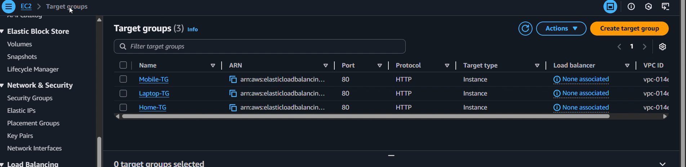

---

### ➤ **Step 5: Create Application Load Balancer**
1. Go to **Load Balancer → Create → Application Load Balancer**.  
   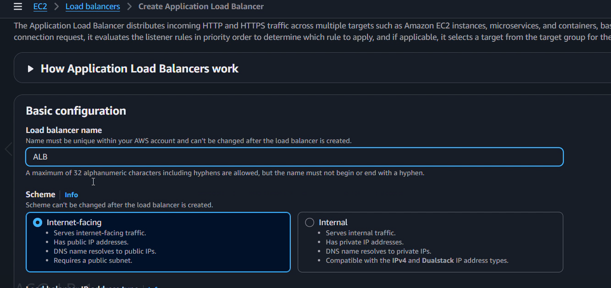

2. Configure:
   - Scheme: **Internet-facing**
   - Listener: **HTTP (port 80)**
   - Availability Zones: select at least 2
   - Security group: allow **HTTP (80)** access
3. Under **Default Action**, forward to **home-target-group**.
   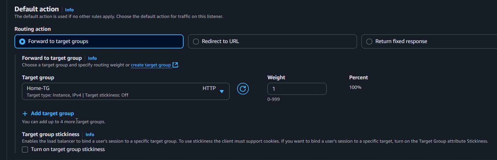
  
4. Click **Create Load Balancer**.

---

### ➤ **Step 6: Configure Path-Based Routing Rules**
After ALB is created:
1. Go to **Listeners → HTTP:80 → Manage Rules**.
   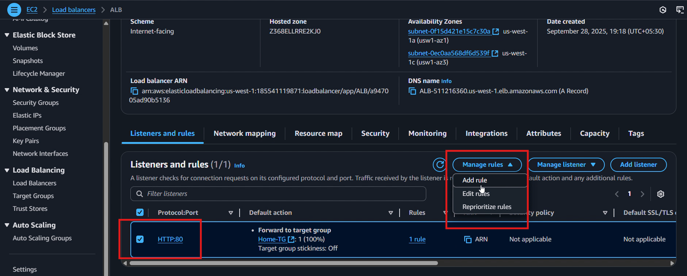
2. Add rules:
   - **Rule 1:**  
     - Condition: `Path is /mobile/*`
     - 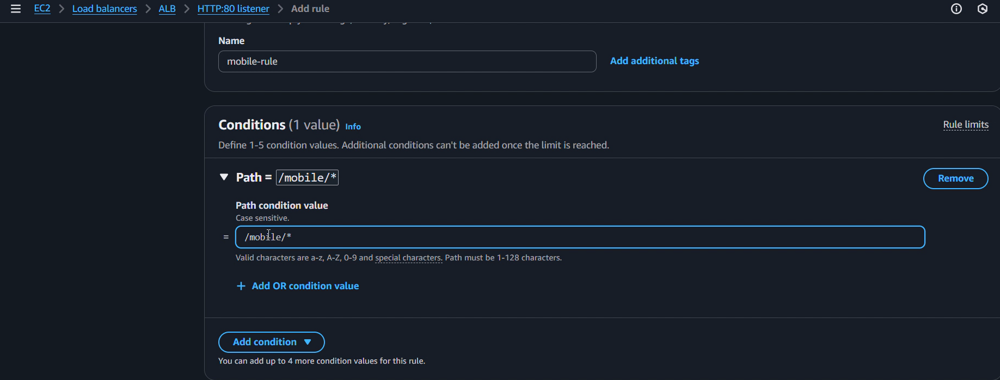
     - Action: Forward to `Mobile-TG`  
     - 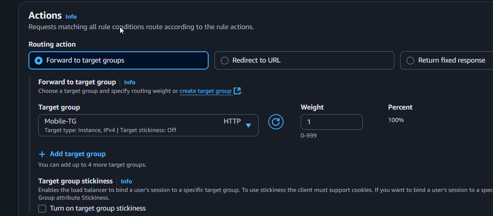
     - Priority: 1
     - 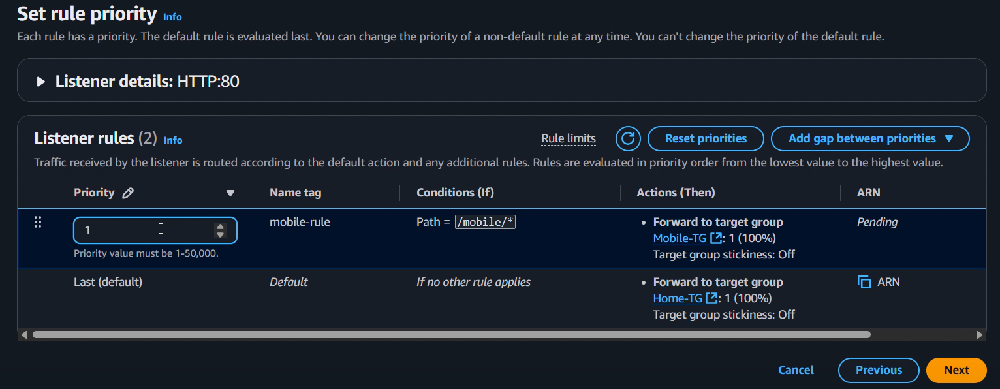

   - **Rule 2:**  
     - Condition: `Path is /laptop/*`  
     - 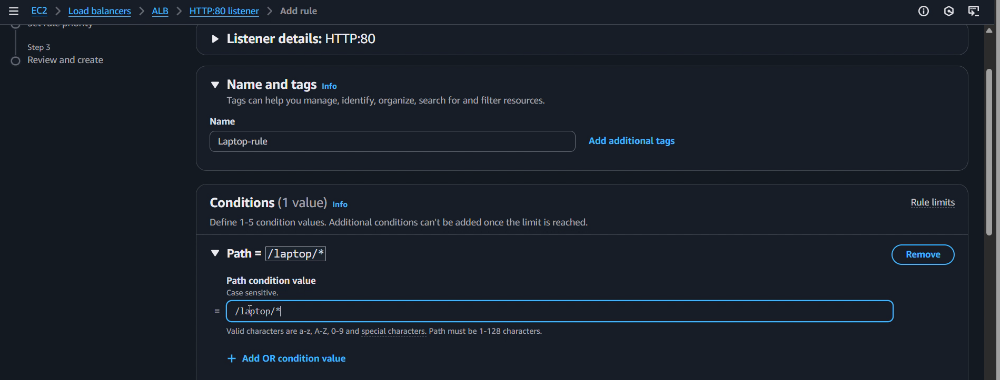
     - Action: Forward to `Laptop-TG`  
     - 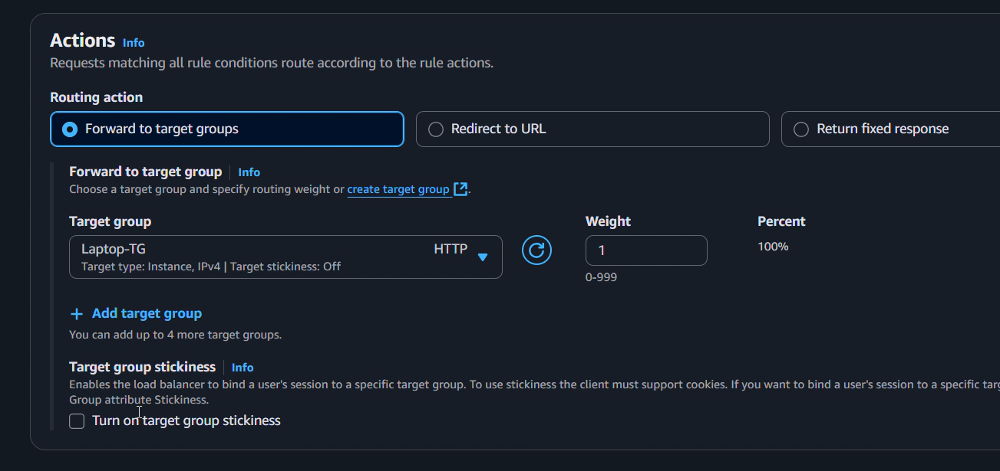
     - Priority: 2
     - 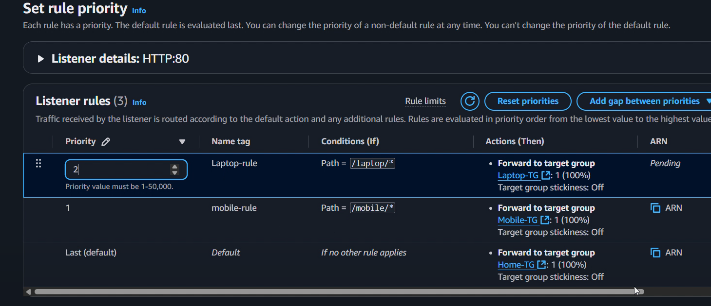
3. Save changes.

---

### ➤ **Step 7: Attach Target Groups to Auto Scaling Groups**
For each ASG:
1. Go to **Auto Scaling Groups → Select ASG → Actions → Edit Load Balancing**.
2. Attach the corresponding Target Group:
   - `home` ASG → `home-TG`
      - 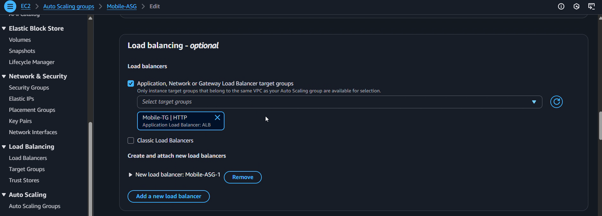
   - `laptop` ASG → `laptop-TG`
      - 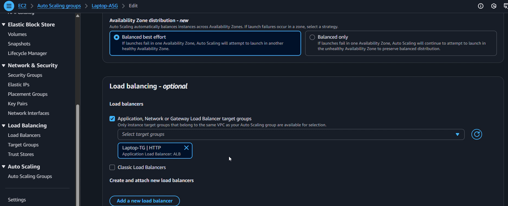
   - `mobile` ASG → `mobile-TG`
      - 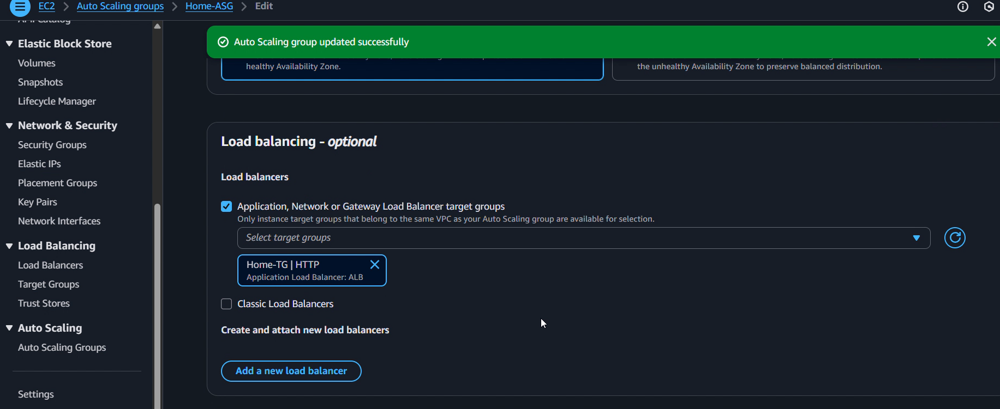
3. Click **Update**.

---

### ➤ **Step 8: Test the Setup**
1. Go to the **Load Balancer → Description tab**.

2. Copy the **DNS name**.
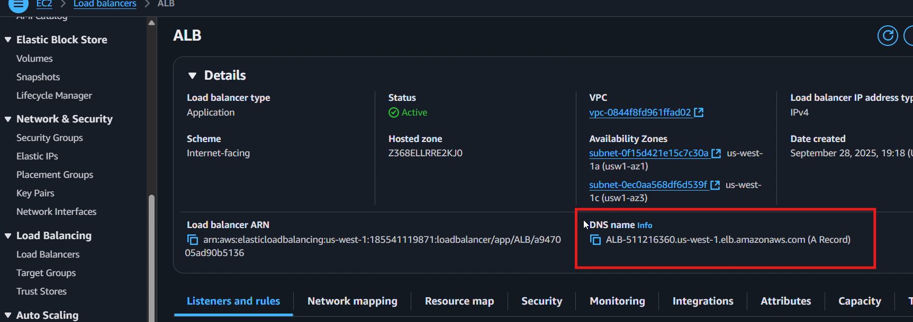

3. Test Home page Auto Scaling in browser :
   - `http://<DNS-name>/` → Home page 
   - 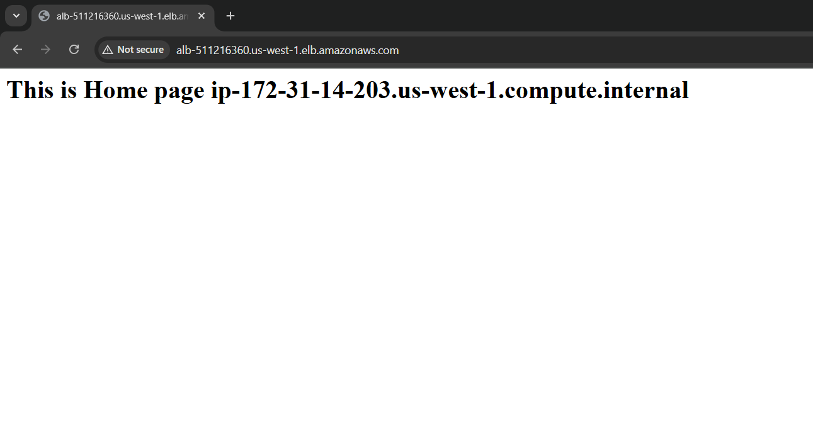
   - 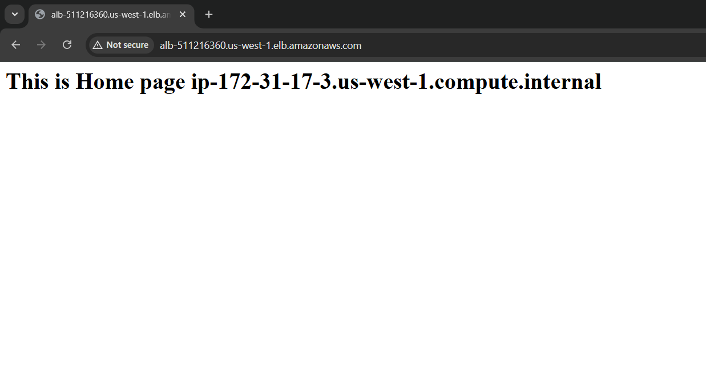

4. Test Laptop page Auto Scaling in browser :
   - `http://<DNS-name>/laptop/` → Laptop page  
   - 
   - 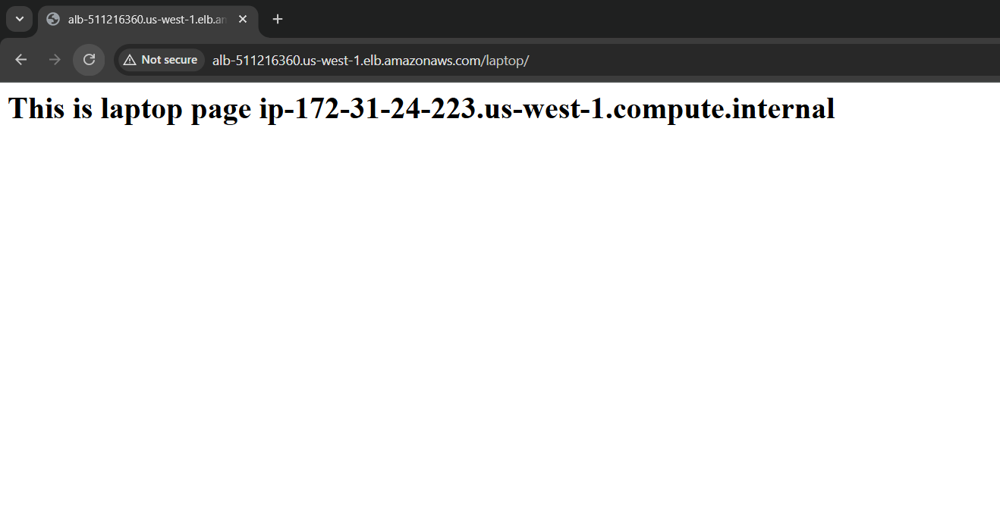

5. Test Mobile page Auto Scaling in browser :
   - `http://<DNS-name>/mobile/` → Mobile page  
   - 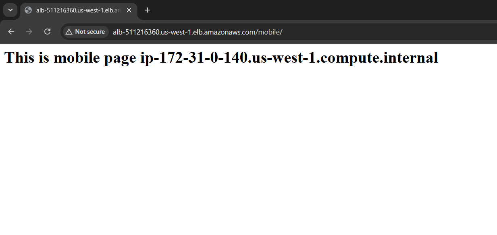
   - 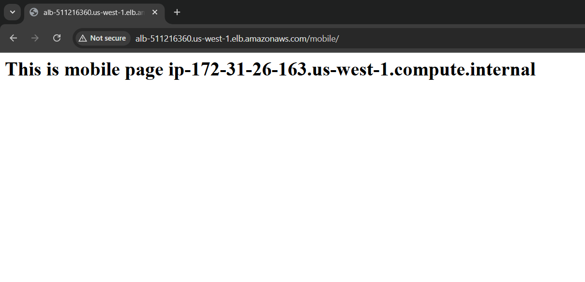

---

## ➤ Verification
- ALB routes traffic correctly based on URL paths.  
- Instances launch automatically within each Auto Scaling Group.  
- Scaling policies trigger based on CPU utilization.  
- Scheduled scaling activates during the “Great Indian Sale” period.  
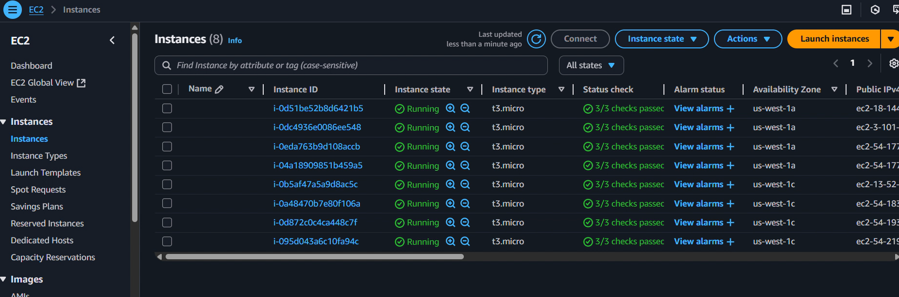
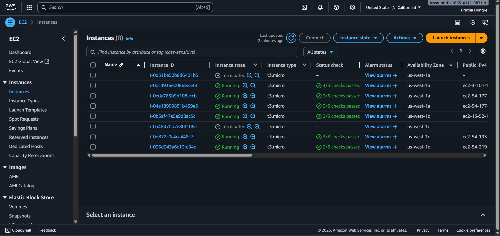
---

## ➤ Key Learnings
- How to configure **Application Load Balancer** with **path-based routing**.  
- How to attach **Auto Scaling Groups** to different target groups.  
- How to automate scaling using **CPU metrics** and **scheduled actions**.  
- Ensuring **high availability** by using multiple Availability Zones.

---

## ➤ Conclusion
This project successfully implements a **scalable**, **fault-tolerant**, and **load-balanced** architecture using AWS EC2, Auto Scaling, and Application Load Balancer.  
It demonstrates real-world deployment patterns for multi-application environments.